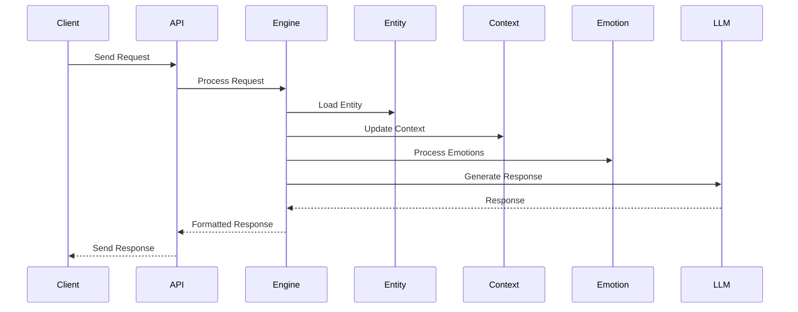

# MemOS AI Architecture Deep Dive

## Overview

This document provides a detailed technical overview of the MemOS AI Framework architecture, including core components, data flows, and system interactions.

## System Architecture

### High-Level Overview

```mermaid
graph TB
    subgraph Client Layer
        CLI[CLI Client]
        API[API Client]
        SDK[SDK Client]
    end

    subgraph Application Layer
        Router[API Router]
        Auth[Authentication]
        RateLimit[Rate Limiter]
    end

    subgraph Core Layer
        Engine[MemOS Engine]
        EntityMgr[Entity Manager]
        ContextMgr[Context Manager]
        EmotionEng[Emotion Engine]
    end

    subgraph Integration Layer
        LLM[LLM Integration]
        Social[Social Integration]
        Media[Media Processing]
    end

    subgraph Storage Layer
        DB[(Database)]
        Cache[(Cache)]
        FileStore[(File Storage)]
    end

    Client Layer --> Application Layer
    Application Layer --> Core Layer
    Core Layer --> Integration Layer
    Core Layer --> Storage Layer
    Integration Layer --> Storage Layer
```

## Core Components

### 1. MemOS Engine

The central orchestrator of the system, responsible for:

```python
class MemOSEngine:
    def __init__(self, config: Config):
        self.entity_manager = EntityManager()
        self.context_manager = ContextManager()
        self.emotion_engine = EmotionEngine()
        self.state_manager = StateManager()
        self.integration_manager = IntegrationManager()

    async def process_interaction(
        self,
        entity_id: str,
        interaction: Interaction
    ) -> Response:
        # Load entity
        entity = await self.entity_manager.get_entity(entity_id)
        
        # Update context
        context = await self.context_manager.update_context(
            entity,
            interaction
        )
        
        # Process emotions
        emotional_state = await self.emotion_engine.process(
            entity,
            interaction,
            context
        )
        
        # Generate response
        response = await self.generate_response(
            entity,
            interaction,
            context,
            emotional_state
        )
        
        # Update state
        await self.state_manager.update(
            entity,
            response,
            context,
            emotional_state
        )
        
        return response
```

### 2. Entity Management

Handles meme entity lifecycle:

```python
class EntityManager:
    def __init__(self):
        self.store = EntityStore()
        self.cache = EntityCache()
        self.validator = EntityValidator()

    async def create_entity(
        self,
        data: Dict[str, Any]
    ) -> MemeEntity:
        # Validate entity data
        validated_data = self.validator.validate(data)
        
        # Create entity
        entity = MemeEntity(**validated_data)
        
        # Initialize components
        await self.initialize_components(entity)
        
        # Store entity
        await self.store.save(entity)
        await self.cache.set(entity.id, entity)
        
        return entity

    async def initialize_components(
        self,
        entity: MemeEntity
    ) -> None:
        # Initialize context
        entity.context = await self.create_context(entity)
        
        # Initialize emotional state
        entity.emotional_state = await self.create_emotional_state(entity)
        
        # Initialize features
        entity.features = await self.extract_features(entity)
```

### 3. Context Management

Manages contextual awareness:

```python
class ContextManager:
    def __init__(self):
        self.context_store = ContextStore()
        self.analyzer = ContextAnalyzer()
        self.validator = ContextValidator()

    async def update_context(
        self,
        entity: MemeEntity,
        interaction: Interaction
    ) -> Context:
        # Get current context
        current_context = await self.get_context(entity)
        
        # Extract context from interaction
        interaction_context = await self.analyzer.analyze(interaction)
        
        # Merge contexts
        merged_context = self.merge_contexts(
            current_context,
            interaction_context
        )
        
        # Validate new context
        validated_context = self.validator.validate(merged_context)
        
        # Store updated context
        await self.context_store.save(entity.id, validated_context)
        
        return validated_context
```

### 4. Emotion Engine

Handles emotional intelligence:

```python
class EmotionEngine:
    def __init__(self):
        self.analyzer = EmotionAnalyzer()
        self.processor = EmotionProcessor()
        self.store = EmotionStore()

    async def process(
        self,
        entity: MemeEntity,
        interaction: Interaction,
        context: Context
    ) -> EmotionalState:
        # Analyze emotional content
        emotion_data = await self.analyzer.analyze(interaction)
        
        # Process with context
        processed_emotions = await self.processor.process(
            emotion_data,
            context
        )
        
        # Update emotional state
        new_state = await self.update_state(
            entity,
            processed_emotions
        )
        
        return new_state
```

## Data Flow

### 1. Request Processing



### 2. State Management

```python
class StateManager:
    def __init__(self):
        self.store = StateStore()
        self.cache = StateCache()
        self.validator = StateValidator()
        self.event_bus = EventBus()

    async def update_state(
        self,
        entity: MemeEntity,
        updates: Dict[str, Any]
    ) -> State:
        async with self.lock(entity.id):
            # Get current state
            current_state = await self.get_state(entity)
            
            # Apply updates
            new_state = self.apply_updates(current_state, updates)
            
            # Validate state
            validated_state = self.validator.validate(new_state)
            
            # Store state
            await self.store.save(entity.id, validated_state)
            await self.cache.set(entity.id, validated_state)
            
            # Emit event
            await self.event_bus.emit(
                "state_updated",
                {
                    "entity_id": entity.id,
                    "old_state": current_state,
                    "new_state": validated_state
                }
            )
            
            return validated_state
```

## Integration Architecture

### 1. LLM Integration

```python
class LLMIntegrationManager:
    def __init__(self):
        self.providers = {
            "openai": OpenAIProvider(),
            "anthropic": AnthropicProvider(),
            "google": GoogleAIProvider(),
            "llama": LlamaProvider()
        }
        self.router = LLMRouter()
        self.fallback_handler = FallbackHandler()

    async def process(
        self,
        prompt: str,
        context: Dict[str, Any]
    ) -> LLMResponse:
        # Select provider
        provider = await self.router.select_provider(context)
        
        try:
            # Process with primary provider
            response = await provider.generate(prompt, context)
        except Exception as e:
            # Handle fallback
            response = await self.fallback_handler.handle(
                e,
                prompt,
                context,
                self.providers
            )
        
        return response
```

### 2. Social Media Integration

```python
class SocialMediaManager:
    def __init__(self):
        self.platforms = {
            "twitter": TwitterIntegration(),
            "instagram": InstagramIntegration(),
            "tiktok": TikTokIntegration(),
            "reddit": RedditIntegration()
        }
        self.content_validator = ContentValidator()
        self.rate_limiter = RateLimiter()

    async def post_content(
        self,
        content: Content,
        platforms: List[str]
    ) -> Dict[str, PostResult]:
        results = {}
        
        # Validate content
        validated_content = await self.content_validator.validate(
            content,
            platforms
        )
        
        # Post to each platform
        for platform in platforms:
            if integration := self.platforms.get(platform):
                try:
                    # Check rate limits
                    await self.rate_limiter.check(platform)
                    
                    # Post content
                    result = await integration.post(validated_content)
                    results[platform] = result
                    
                except Exception as e:
                    results[platform] = PostError(str(e))
        
        return results
```

## Performance Considerations

### 1. Caching Strategy

```python
class CacheManager:
    def __init__(self):
        self.cache = RedisCache()
        self.policy = CachePolicy()

    async def get_or_compute(
        self,
        key: str,
        computer: Callable,
        ttl: Optional[int] = None
    ) -> Any:
        # Check cache
        if cached := await self.cache.get(key):
            return cached
        
        # Compute value
        value = await computer()
        
        # Cache value
        await self.cache.set(
            key,
            value,
            ttl or self.policy.get_ttl(key)
        )
        
        return value
```

### 2. Load Balancing

```python
class LoadBalancer:
    def __init__(self):
        self.nodes = []
        self.health_checker = HealthChecker()
        self.strategy = RoundRobinStrategy()

    async def route_request(
        self,
        request: Request
    ) -> Response:
        # Get available nodes
        available_nodes = await self.health_checker.get_healthy_nodes()
        
        # Select node
        node = self.strategy.select_node(available_nodes)
        
        # Route request
        response = await node.process(request)
        
        # Update metrics
        await self.update_metrics(node, response)
        
        return response
```

## Security Architecture

### 1. Authentication

```python
class AuthenticationManager:
    def __init__(self):
        self.providers = {
            "jwt": JWTAuthProvider(),
            "oauth": OAuthProvider(),
            "api_key": APIKeyProvider()
        }
        self.token_manager = TokenManager()

    async def authenticate(
        self,
        credentials: Dict[str, Any]
    ) -> AuthResult:
        # Select provider
        provider = self.select_provider(credentials)
        
        # Authenticate
        auth_result = await provider.authenticate(credentials)
        
        # Generate token
        token = await self.token_manager.create_token(auth_result)
        
        return AuthResult(token=token, user=auth_result.user)
```

### 2. Authorization

```python
class AuthorizationManager:
    def __init__(self):
        self.policy_manager = PolicyManager()
        self.role_manager = RoleManager()

    async def check_permission(
        self,
        user: User,
        resource: str,
        action: str
    ) -> bool:
        # Get user roles
        roles = await self.role_manager.get_user_roles(user)
        
        # Get policies
        policies = await self.policy_manager.get_policies(roles)
        
        # Check permission
        return await self.evaluate_policies(
            policies,
            resource,
            action
        )
```

## Monitoring and Observability

### 1. Metrics Collection

```python
class MetricsCollector:
    def __init__(self):
        self.collectors = {
            "prometheus": PrometheusCollector(),
            "statsd": StatsDCollector()
        }
        self.aggregator = MetricsAggregator()

    async def collect_metrics(
        self,
        metric_type: str,
        values: Dict[str, Any]
    ) -> None:
        # Process metrics
        processed_metrics = await self.aggregator.process(
            metric_type,
            values
        )
        
        # Send to collectors
        for collector in self.collectors.values():
            await collector.send(processed_metrics)
```

### 2. Logging

```python
class LogManager:
    def __init__(self):
        self.loggers = {
            "app": ApplicationLogger(),
            "access": AccessLogger(),
            "error": ErrorLogger()
        }
        self.formatter = LogFormatter()

    async def log(
        self,
        level: str,
        message: str,
        context: Dict[str, Any]
    ) -> None:
        # Format log entry
        formatted_log = self.formatter.format(
            level,
            message,
            context
        )
        
        # Send to appropriate loggers
        for logger in self.loggers.values():
            await logger.log(formatted_log)
```

## Deployment Architecture

### 1. Container Configuration

```yaml
version: '3.8'

services:
  api:
    build: .
    ports:
      - "8000:8000"
    environment:
      - MEMOS_ENV=production
      - MEMOS_LOG_LEVEL=info
    depends_on:
      - redis
      - postgres
    networks:
      - memos_network

  worker:
    build: .
    command: celery -A memos.tasks worker
    environment:
      - MEMOS_ENV=production
    depends_on:
      - redis
    networks:
      - memos_network

  redis:
    image: redis:alpine
    ports:
      - "6379:6379"
    networks:
      - memos_network

  postgres:
    image: postgres:13
    environment:
      - POSTGRES_USER=memos
      - POSTGRES_PASSWORD=secret
    volumes:
      - postgres_data:/var/lib/postgresql/data
    networks:
      - memos_network

networks:
  memos_network:
    driver: bridge

volumes:
  postgres_data:
```

### 2. Kubernetes Configuration

```yaml
apiVersion: apps/v1
kind: Deployment
metadata:
  name: memos-api
spec:
  replicas: 3
  selector:
    matchLabels:
      app: memos-api
  template:
    metadata:
      labels:
        app: memos-api
    spec:
      containers:
      - name: memos-api
        image: memos/api:latest
        ports:
        - containerPort: 8000
        env:
        - name: MEMOS_ENV
          value: production
        - name: MEMOS_LOG_LEVEL
          value: info
        resources:
          limits:
            cpu: "1"
            memory: "1Gi"
          requests:
            cpu: "500m"
            memory: "512Mi"
        livenessProbe:
          httpGet:
            path: /health
            port: 8000
          initialDelaySeconds: 30
          periodSeconds: 10
        readinessProbe:
          httpGet:
            path: /ready
            port: 8000
          initialDelaySeconds: 5
          periodSeconds: 5
```

This document provides a technical overview of the MemOS AI architecture. For implementation details, refer to the [API Reference](../api/index.md) and [Examples](../examples/index.md) sections. 