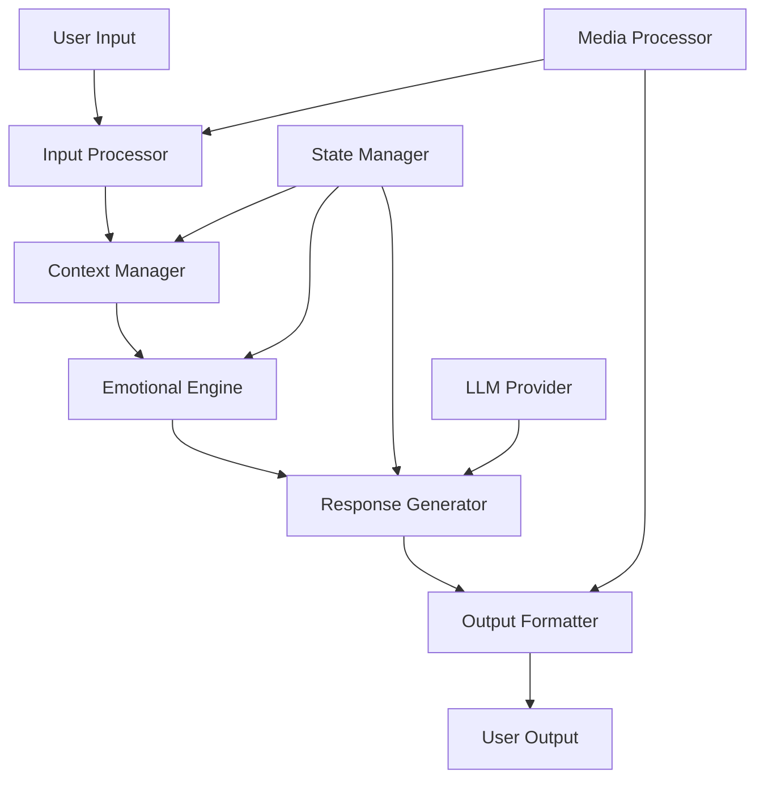

# Advanced Interaction Patterns

This guide covers advanced interaction patterns in the MemOS AI Framework, including complex state management, multi-modal interactions, and distributed processing.

## Table of Contents
- [Overview](#overview)
- [Interaction Architecture](#interaction-architecture)
- [State Management](#state-management)
- [Multi-Modal Processing](#multi-modal-processing)
- [Advanced Patterns](#advanced-patterns)
- [Implementation Examples](#implementation-examples)

## Overview

MemOS AI supports complex interaction patterns that go beyond simple request-response cycles. These patterns enable rich, contextual, and stateful interactions between users and meme entities.

## Interaction Architecture

### Core Components



### Data Flow

1. **Input Processing**
   ```python
   async def process_interaction(
       entity: MemeEntity,
       interaction: Dict[str, Any]
   ) -> InteractionResult:
       # Validate input
       validated_input = await validate_interaction(interaction)
       
       # Update context
       context = await entity.context_manager.update(validated_input)
       
       # Process emotional state
       emotional_state = await entity.emotion_engine.process(
           context,
           validated_input
       )
       
       # Generate response
       response = await generate_response(
           entity,
           context,
           emotional_state,
           validated_input
       )
       
       return InteractionResult(
           response=response,
           context=context,
           emotional_state=emotional_state
       )
   ```

## State Management

### Stateful Interactions

```python
class StatefulInteraction:
    def __init__(self, entity: MemeEntity):
        self.entity = entity
        self.state_manager = StateManager()
        self.interaction_history = []
    
    async def process_step(
        self,
        input_data: Dict[str, Any]
    ) -> InteractionResponse:
        # Update state
        current_state = await self.state_manager.get_state()
        next_state = await self.calculate_next_state(
            current_state,
            input_data
        )
        
        # Process interaction
        response = await self.entity.process_interaction(
            input_data,
            state=next_state
        )
        
        # Update history
        self.interaction_history.append({
            "input": input_data,
            "state": next_state,
            "response": response
        })
        
        return response
```

### State Synchronization

```python
class DistributedStateManager:
    def __init__(self):
        self.state_store = RedisStateStore()
        self.lock_manager = DistributedLock()
    
    async def update_state(
        self,
        entity_id: str,
        updates: Dict[str, Any]
    ) -> None:
        async with self.lock_manager.acquire(f"entity:{entity_id}"):
            current_state = await self.state_store.get(entity_id)
            new_state = self.merge_states(current_state, updates)
            await self.state_store.set(entity_id, new_state)
            await self.publish_state_update(entity_id, new_state)
```

## Multi-Modal Processing

### Modal Integration

```python
class MultiModalProcessor:
    def __init__(self):
        self.text_processor = TextProcessor()
        self.image_processor = ImageProcessor()
        self.video_processor = VideoProcessor()
        self.audio_processor = AudioProcessor()
    
    async def process_input(
        self,
        input_data: MultiModalInput
    ) -> ProcessedInput:
        tasks = []
        
        # Process each modality
        if input_data.text:
            tasks.append(self.text_processor.process(input_data.text))
        if input_data.image:
            tasks.append(self.image_processor.process(input_data.image))
        if input_data.video:
            tasks.append(self.video_processor.process(input_data.video))
        if input_data.audio:
            tasks.append(self.audio_processor.process(input_data.audio))
        
        # Process in parallel
        results = await asyncio.gather(*tasks)
        
        # Fuse results
        fused_result = await self.fuse_results(results)
        
        return fused_result
```

## Advanced Patterns

### Event-Driven Interactions

```python
class EventDrivenInteraction:
    def __init__(self):
        self.event_bus = EventBus()
        self.handlers = {}
    
    def register_handler(
        self,
        event_type: str,
        handler: Callable
    ) -> None:
        self.handlers[event_type] = handler
    
    async def handle_event(self, event: Event) -> None:
        if handler := self.handlers.get(event.type):
            await handler(event)
        else:
            await self.default_handler(event)
```

### Reactive Processing

```python
class ReactiveProcessor:
    def __init__(self):
        self.processors = []
        self.middleware = []
    
    def add_processor(
        self,
        processor: Callable,
        condition: Optional[Callable] = None
    ) -> None:
        self.processors.append((processor, condition))
    
    async def process(self, data: Any) -> Any:
        result = data
        
        # Apply middleware
        for middleware in self.middleware:
            result = await middleware(result)
        
        # Apply processors
        for processor, condition in self.processors:
            if condition is None or await condition(result):
                result = await processor(result)
        
        return result
```

## Implementation Examples

### Complex Interaction Flow

```python
async def complex_interaction_example():
    # Initialize components
    entity = MemeEntity.from_image("example.jpg")
    processor = MultiModalProcessor()
    state_manager = DistributedStateManager()
    
    # Configure event handlers
    interaction = EventDrivenInteraction()
    interaction.register_handler(
        "user_input",
        lambda e: process_user_input(e, entity)
    )
    interaction.register_handler(
        "state_change",
        lambda e: state_manager.update_state(entity.id, e.data)
    )
    
    # Start processing
    while True:
        # Get input
        input_data = await get_next_input()
        
        # Process multi-modal input
        processed_input = await processor.process_input(input_data)
        
        # Update state
        await state_manager.update_state(
            entity.id,
            {"last_input": processed_input}
        )
        
        # Generate response
        response = await entity.generate_response(processed_input)
        
        # Format and send output
        await send_response(response)
```

### Advanced State Management

```python
class ComplexStateManager:
    def __init__(self):
        self.state_store = StateStore()
        self.event_bus = EventBus()
        self.cache = StateCache()
    
    async def update_state(
        self,
        entity_id: str,
        updates: Dict[str, Any],
        metadata: Optional[Dict[str, Any]] = None
    ) -> None:
        # Get current state
        current_state = await self.state_store.get(entity_id)
        
        # Apply updates
        new_state = self.merge_states(current_state, updates)
        
        # Validate state transition
        if not self.validate_state_transition(current_state, new_state):
            raise InvalidStateTransition()
        
        # Store new state
        await self.state_store.set(entity_id, new_state)
        
        # Update cache
        await self.cache.set(entity_id, new_state)
        
        # Emit event
        await self.event_bus.emit(
            "state_changed",
            {
                "entity_id": entity_id,
                "old_state": current_state,
                "new_state": new_state,
                "metadata": metadata
            }
        )
```

This guide covers advanced interaction patterns in MemOS AI. For more specific implementations and use cases, refer to the [Examples](../../examples/advanced/index.md) section. 